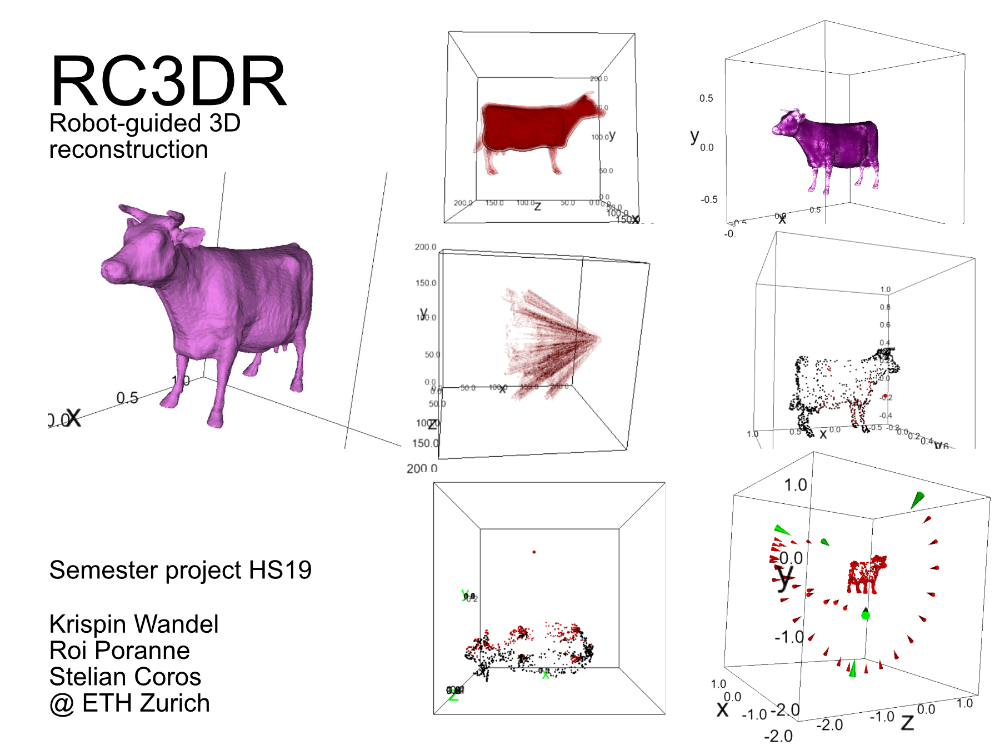

# RC3DR
Robot-controlled 3D reconstruction

This project is heavily based on the following two papers:
- Xinyi Fan, Linguang Zhang, Benedict Brown, and Szymon Rusinkiewicz. 2016. Automated view and path planning for scalable multi-object 3D scanning. ACM Trans. Graph. 35, 6, Article 239 (November 2016), 13 pages. DOI:https://doi.org/10.1145/2980179.2980225
- R. A. Newcombe et al., "KinectFusion: Real-time dense surface mapping and tracking," 2011 10th IEEE International Symposium on Mixed and Augmented Reality, Basel, 2011, pp. 127-136.

To get startet have a look at the jupyter notebook **RC3DR.ipynb**. Note, the *jupyter notebook* is testet in *Firefox* and the **WebApp** in **Chrome**.

## *Required packages*:
- numpy
- scipy
- numba
- python-socketio
- tornado
- skimage
- igl
- pyquaternion

You will also need a **Cuda** enabled GPU.

